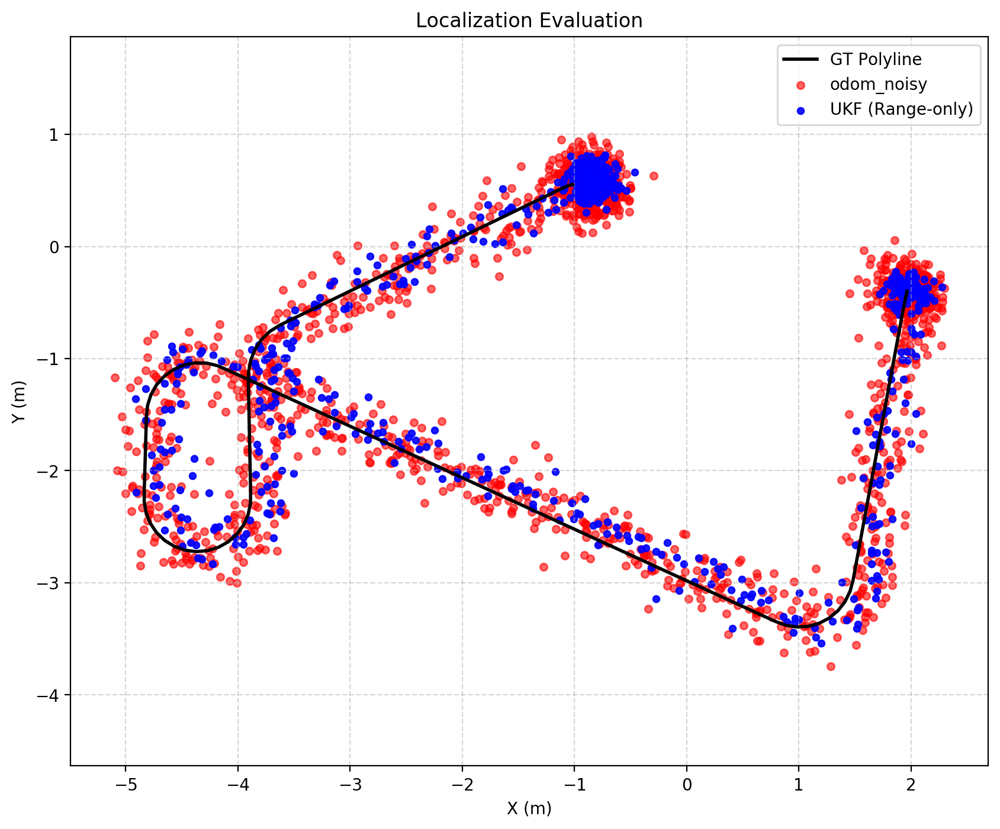
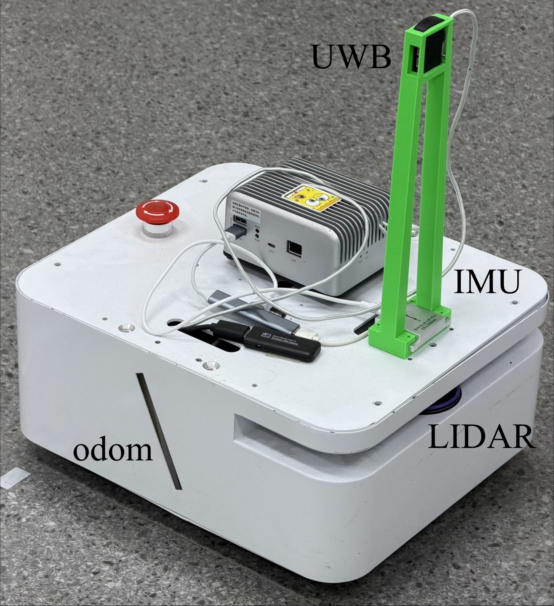

> 🌐 **English** | [简体中文](README_zh-CN.md)

---

# UWB-Enhanced Multi-Robot Localization



**UWB-Enhanced Multi-Robot Cooperative Localization System**  
*(ROS 2 + Gazebo Simulation)*

This project implements a framework for improving **relative localization** among multiple robots using **Ultra-Wideband (UWB)** ranging measurements. By fusing each robot's wheel odometry with inter-robot UWB distance observations, the system significantly reduces localization drift in GNSS-denied environments (e.g., indoors, underground, or dense forests).

Key techniques include:
- Multi-robot trilateration for relative position estimation
- Unscented Kalman Filter (UKF) for sensor fusion
- Realistic Gazebo simulation with a custom UWB ranging plugin

<div align="center">
    
</div>

---

## 🔬 Background & Application Scenarios

Traditional Unscented Kalman Filter (UKF) algorithms relying solely on Odometry, IMU, and Lidar/Visual SLAM inherently suffer from cumulative drift and kinematic dependency. When subjected to extreme spatial mutations or sustained geometric feature loss, standard state estimation diverges, leading to irreversible localization failure. By fusing Ultra-Wideband (UWB) absolute distance constraints, this multi-robot cooperative localization system fundamentally overcomes these limitations through inter-node spatial rigid constraints.

### Scenario 1: Extreme State Mutation and Global Relocalization (Kidnapped Robot)

https://github.com/user-attachments/assets/337f2022-1c17-47c2-a752-7a696de896fd

* **Background:** Traditional Lidar/Visual SLAM relies heavily on continuous kinematic extrapolation. When a robot is "kidnapped" (picked up, subjected to severe impact, or experiences total wheel slip), the continuous pose assumption breaks down. Scan matching fails, state covariance diverges instantly, and the localization system collapses.
* **Underlying Logic:** UWB introduces absolute range constraints that are independent of kinematic continuity. During an abrupt large-scale displacement, the UKF algorithm bypasses the failed Lidar frontend. It leverages the high-confidence pose priors of the other two cooperative vehicles and the UWB multilateration measurement equations to force the divergent pose to converge to the true physical coordinates within a few filter cycles, achieving **feature-independent global relocalization**.
* **Premises & Risks:** This assumes the two anchor vehicles maintain accurate global poses during the event. The risk is that if the kidnapping distance exceeds the maximum UWB communication range or encounters severe RF shielding, the relocalization cannot be deduced.

### Scenario 2: Dynamic Compensation in Degenerated Environments

https://github.com/user-attachments/assets/96c60db6-e851-40e3-ae7f-a42512d7292b

* **Background:** In environments like long straight corridors or featureless open spaces, Lidar suffers from a lack of geometric features in specific degrees of freedom (e.g., longitudinal translation). The scan-matching algorithm degenerates, leaving the odometry's integration drift uncorrected, which leads to severely stretched or compressed maps.
* **Underlying Logic:** In this degenerated state, the two distant cooperative vehicles act as a dynamic UWB reference network. The UKF dynamically adjusts sensor weights and injects the low-frequency, absolute distance constraints provided by UWB into the update step. This rigidly compensates for the Lidar's observational blind spot in that specific DoF, physically locking down the longitudinal cumulative drift caused by feature loss.
* **Premises & Risks:** This assumes the assisting vehicles are located in non-degenerated areas or have independent reliable localization. A significant potential risk is **Collinearity Ambiguity**: if all three robots are perfectly aligned in a straight line within the corridor, the lateral geometric constraints from UWB drop to zero, which can lead to matrix singularities or flip ambiguity in the lateral covariance estimation.

## ✨ Features

- **Infrastructure-free relative localization**: Robots estimate each other's positions in their local coordinate frames without external anchors or global references.
- **Robust sensor fusion**: Combines noisy odometry with UWB range measurements using UKF.
- **Modular architecture**:
  - `multi_robot_trilat/`: Multi-robot trilateration node
  - `robot_fusion/`: UKF fusion, Gazebo simulation, and UWB distance publisher
  - `odom_noise/`: Realistic odometry noise simulation
  - `trilat_eval/`: Localization accuracy evaluation tools (compared against ground truth)
- **Simulation-ready**: Supports 3+ robots with manual circular motion for evaluation.
- **ROS 2 native**: Uses standard message interfaces for easy extension to real hardware.

---

## 📁 Repository Structure

```
uwb-enhanced-multi-robot-locolization/
├── multi_robot_trilat/          # Multi-robot trilateration module
├── odom_noise/                  # Odometry noise simulation
├── robot_fusion/                # UKF fusion + Gazebo + UWB plugin
│   ├── launch/                  # Launch files
│   └── ...
├── trilat_eval/                 # Evaluation and metrics tools
├── uwbpsr_ratros2/              # UWB-related ROS 2 package (if present)
├── LICENSE
├── README.md
└── instructions.txt                     # Original Chinese running instructions
```

---

## 🚀 Quick Start

### Prerequisites

- **OS**: Ubuntu 20.04 or 22.04
- **ROS 2**: Galastic (recommended) or Iron
- **Gazebo**: Harmonic or Classic (depending on ROS 2 version)
- **Build tools**: `colcon`, `rosdep`

### Installation

```bash
# 1. Create workspace
mkdir -p ~/fusion_ws/src
cd ~/fusion_ws/src

# 2. Clone the repository
git clone https://github.com/crzzo0129/uwb-enhanced-multi-robot-locolization.git

# 3. Install dependencies
cd ~/fusion_ws
rosdep install --from-paths src --ignore-src -r -y

# 4. Build the workspace
colcon build --symlink-install
source install/setup.bash
```

### Running the Simulation

Refer to the original `指令.txt` for detailed commands. Typical workflow:

```bash
# Launch the full multi-robot simulation with UWB and UKF (example)
ros2 launch robot_fusion robot_fusion.launch.py
ros2 launch odom_noise odom_noise.launch.py
ros2 launch robot_fusion custom_ukf.launch.py
```

**Tip**: Use the `trilat_eval` module to collect data while manually driving robots in circular trajectories for accuracy assessment.

---

## 📊 System Overview

1. **UWB Ranging Simulation**: A Gazebo plugin publishes inter-robot distances (e.g., `/robot_distances` topic) with realistic noise.
2. **Trilateration**: The `multi_robot_trilat` package computes coarse relative positions using UWB ranges (outputs topics like `/rbX/tri_pos_in_rbY`).
3. **UKF Fusion**: Each robot runs an independent UKF node that fuses its own odometry with trilateration observations for smoother, more accurate pose estimates.
4. **Noise Modeling**: `odom_noise` adds Gaussian noise to Gazebo odometry to simulate real-world sensor imperfections.
5. **Evaluation**: `trilat_eval` compares UKF estimates against Gazebo ground truth and computes metrics such as RMSE.

This pipeline effectively mitigates odometry drift using occasional UWB range updates.

---

## 📈 Expected Results

- Pure odometry drifts significantly over time.
- With UWB + UKF fusion, relative positioning error is greatly reduced.
- The framework is extensible to 3–N robots.

---

## 🛠️ Future Work & Contributions

- Port to real UWB hardware (e.g., Decawave, Qorvo, Pozyx).
- Integrate graph-based optimization (Pose Graph) for global consistency.
- Support dynamic addition/removal of robots.
- Add visualization presets for RViz2 and PlotJuggler.
- Validate on physical platforms (TurtleBot, Jackal, etc.).

---

## 📄 License

This project is licensed under the **MIT License**. See the [LICENSE](LICENSE) file for details.

---

## 🤝 Contributing

Contributions are welcome! Feel free to open an **Issue** or submit a **Pull Request**.

- Project maintainer: [crzzo0129](https://github.com/crzzo0129)

If you have questions, suggestions, or want to share experimental results, please let us know.

---

⭐ **Star this repository** if you find it helpful!

---
